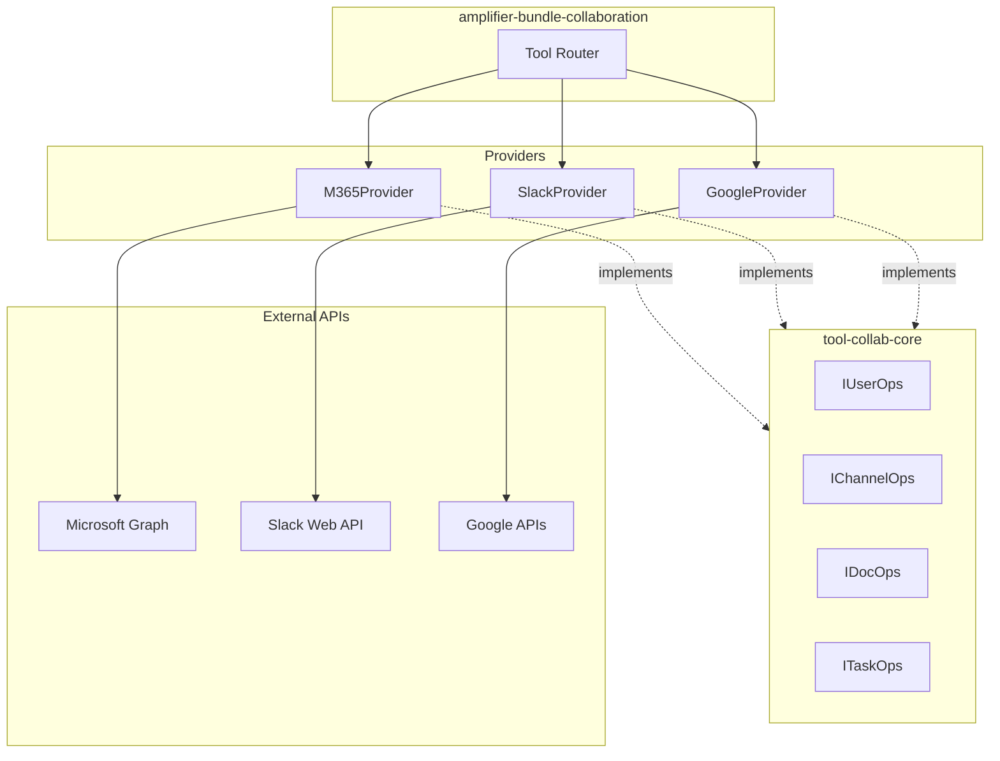
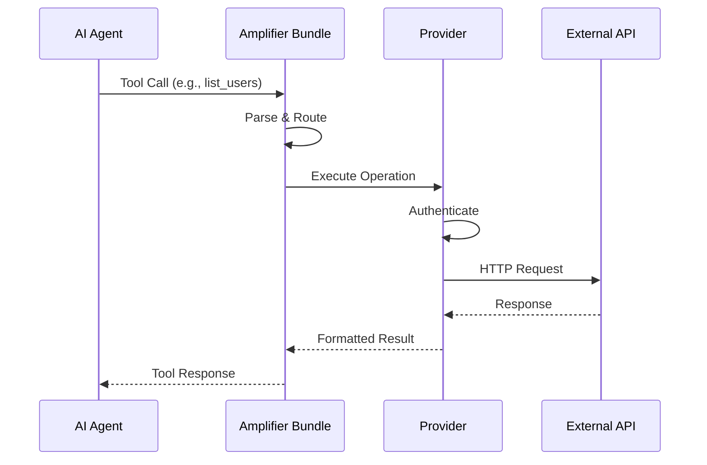

# Amplifier Collaboration Architecture

## 1. High-Level Overview

```
┌─────────────────────────────────────────────────────────────────────────────┐
│                                                                             │
│                      AMPLIFIER BUNDLE COLLABORATION                         │
│                                                                             │
│    Unified interface for Microsoft 365, Slack, and Google Workspace         │
│                                                                             │
└─────────────────────────────────────────────────────────────────────────────┘
                                     │
                                     │  imports
                                     ▼
┌─────────────────────────────────────────────────────────────────────────────┐
│                                                                             │
│                          TOOL-COLLAB-CORE                                   │
│                                                                             │
│  ┌─────────────┐  ┌─────────────┐  ┌─────────────┐  ┌─────────────┐        │
│  │ IUserOps    │  │ IChannelOps │  │ IDocOps     │  │ ITaskOps    │        │
│  │             │  │             │  │             │  │             │        │
│  │ • list      │  │ • list      │  │ • list      │  │ • list      │        │
│  │ • get       │  │ • read      │  │ • upload    │  │ • create    │        │
│  │ • resolve   │  │ • post      │  │ • download  │  │ • complete  │        │
│  └─────────────┘  └─────────────┘  └─────────────┘  └─────────────┘        │
│                                                                             │
└─────────────────────────────────────────────────────────────────────────────┘
                                     │
                                     │  implements
                                     ▼
        ┌────────────────────────────┼────────────────────────────┐
        │                            │                            │
        ▼                            ▼                            ▼
┌───────────────┐          ┌───────────────┐          ┌───────────────┐
│               │          │               │          │               │
│     M365      │          │    SLACK      │          │    GOOGLE     │
│   PROVIDER    │          │   PROVIDER    │          │   PROVIDER    │
│               │          │               │          │               │
│  ┌─────────┐  │          │  ┌─────────┐  │          │  ┌─────────┐  │
│  │ Graph   │  │          │  │ Web API │  │          │  │ Admin   │  │
│  │ API     │  │          │  │         │  │          │  │ SDK     │  │
│  └─────────┘  │          │  └─────────┘  │          │  └─────────┘  │
│               │          │               │          │               │
│  ┌─────────┐  │          │  ┌─────────┐  │          │  ┌─────────┐  │
│  │ Teams   │  │          │  │ Events  │  │          │  │ Chat    │  │
│  │ API     │  │          │  │ API     │  │          │  │ API     │  │
│  └─────────┘  │          │  └─────────┘  │          │  └─────────┘  │
│               │          │               │          │               │
│  ┌─────────┐  │          │  ┌─────────┐  │          │  ┌─────────┐  │
│  │ OneDrive│  │          │  │ Files   │  │          │  │ Drive   │  │
│  │ API     │  │          │  │ API     │  │          │  │ API     │  │
│  └─────────┘  │          │  └─────────┘  │          │  └─────────┘  │
│               │          │               │          │               │
└───────────────┘          └───────────────┘          └───────────────┘
        │                            │                            │
        ▼                            ▼                            ▼
┌───────────────┐          ┌───────────────┐          ┌───────────────┐
│  Microsoft    │          │    Slack      │          │    Google     │
│  365 Cloud    │          │   Platform    │          │   Workspace   │
└───────────────┘          └───────────────┘          └───────────────┘
```

---

## 2. Data Flow Architecture

```
                              ┌─────────────────┐
                              │                 │
                              │   AI AGENT      │
                              │   (Claude)      │
                              │                 │
                              └────────┬────────┘
                                       │
                                       │ tool call
                                       ▼
┌──────────────────────────────────────────────────────────────────────────────┐
│                                                                              │
│                           AMPLIFIER BUNDLE                                   │
│                                                                              │
│  ┌────────────────────────────────────────────────────────────────────────┐  │
│  │                         Tool Router                                    │  │
│  │                                                                        │  │
│  │   Request ──▶ Parse Provider ──▶ Validate ──▶ Route to Provider       │  │
│  │                                                                        │  │
│  └────────────────────────────────────────────────────────────────────────┘  │
│                                       │                                      │
│           ┌───────────────────────────┼───────────────────────────┐          │
│           │                           │                           │          │
│           ▼                           ▼                           ▼          │
│  ┌─────────────────┐        ┌─────────────────┐        ┌─────────────────┐   │
│  │  M365Provider   │        │ SlackProvider   │        │ GoogleProvider  │   │
│  │                 │        │                 │        │                 │   │
│  │ ┌─────────────┐ │        │ ┌─────────────┐ │        │ ┌─────────────┐ │   │
│  │ │ Auth        │ │        │ │ Auth        │ │        │ │ Auth        │ │   │
│  │ │ (OAuth2/App)│ │        │ │ (Bot Token) │ │        │ │ (Service    │ │   │
│  │ └─────────────┘ │        │ └─────────────┘ │        │ │  Account)   │ │   │
│  │                 │        │                 │        │ └─────────────┘ │   │
│  │ ┌─────────────┐ │        │ ┌─────────────┐ │        │                 │   │
│  │ │ API Client  │ │        │ │ API Client  │ │        │ ┌─────────────┐ │   │
│  │ │ (Graph SDK) │ │        │ │ (Web API)   │ │        │ │ API Client  │ │   │
│  │ └─────────────┘ │        │ └─────────────┘ │        │ │ (googleapis)│ │   │
│  │                 │        │                 │        │ └─────────────┘ │   │
│  └────────┬────────┘        └────────┬────────┘        └────────┬────────┘   │
│           │                          │                          │            │
└───────────┼──────────────────────────┼──────────────────────────┼────────────┘
            │                          │                          │
            │ HTTPS                    │ HTTPS                    │ HTTPS
            ▼                          ▼                          ▼
    ┌───────────────┐          ┌───────────────┐          ┌───────────────┐
    │ graph.        │          │ api.slack.com │          │ googleapis.   │
    │ microsoft.com │          │               │          │ com           │
    └───────────────┘          └───────────────┘          └───────────────┘
```

### Request Lifecycle

```
┌─────────┐     ┌─────────┐     ┌─────────┐     ┌─────────┐     ┌─────────┐
│         │     │         │     │         │     │         │     │         │
│ RECEIVE │────▶│  PARSE  │────▶│  AUTH   │────▶│ EXECUTE │────▶│ RESPOND │
│         │     │         │     │         │     │         │     │         │
└─────────┘     └─────────┘     └─────────┘     └─────────┘     └─────────┘
     │               │               │               │               │
     │               │               │               │               │
     ▼               ▼               ▼               ▼               ▼
┌─────────┐     ┌─────────┐     ┌─────────┐     ┌─────────┐     ┌─────────┐
│ Tool    │     │ Extract │     │ Get/    │     │ Call    │     │ Format  │
│ call    │     │ provider│     │ refresh │     │ external│     │ result  │
│ from    │     │ + args  │     │ token   │     │ API     │     │ for AI  │
│ agent   │     │         │     │         │     │         │     │         │
└─────────┘     └─────────┘     └─────────┘     └─────────┘     └─────────┘
```

---

## 3. API Integrations Detail

### Microsoft 365

```
┌──────────────────────────────────────────────────────────────────┐
│                        M365 PROVIDER                             │
├──────────────────────────────────────────────────────────────────┤
│                                                                  │
│  Authentication                                                  │
│  ┌────────────────────────────────────────────────────────────┐  │
│  │  AZURE_CLIENT_ID + AZURE_CLIENT_SECRET + AZURE_TENANT_ID   │  │
│  │                          │                                 │  │
│  │                          ▼                                 │  │
│  │              OAuth2 Client Credentials                     │  │
│  │                          │                                 │  │
│  │                          ▼                                 │  │
│  │                  Access Token                              │  │
│  └────────────────────────────────────────────────────────────┘  │
│                                                                  │
│  API Endpoints                                                   │
│  ┌────────────────┬──────────────────────────────────────────┐  │
│  │ Operation      │ Endpoint                                 │  │
│  ├────────────────┼──────────────────────────────────────────┤  │
│  │ List Users     │ GET /users                               │  │
│  │ Get User       │ GET /users/{id}                          │  │
│  │ List Channels  │ GET /teams/{id}/channels                 │  │
│  │ Read Messages  │ GET /teams/{id}/channels/{id}/messages   │  │
│  │ Post Message   │ POST /teams/{id}/channels/{id}/messages  │  │
│  │ List Files     │ GET /drives/{id}/root/children           │  │
│  │ Upload File    │ PUT /drives/{id}/items/{path}/content    │  │
│  │ Download File  │ GET /drives/{id}/items/{id}/content      │  │
│  │ List Tasks     │ GET /me/todo/lists/{id}/tasks            │  │
│  │ Send Email     │ POST /users/{id}/sendMail                │  │
│  └────────────────┴──────────────────────────────────────────┘  │
│                                                                  │
└──────────────────────────────────────────────────────────────────┘
```

### Slack

```
┌──────────────────────────────────────────────────────────────────┐
│                       SLACK PROVIDER                             │
├──────────────────────────────────────────────────────────────────┤
│                                                                  │
│  Authentication                                                  │
│  ┌────────────────────────────────────────────────────────────┐  │
│  │                   SLACK_BOT_TOKEN                          │  │
│  │                   (xoxb-...)                               │  │
│  │                          │                                 │  │
│  │                          ▼                                 │  │
│  │              Bearer Token Auth                             │  │
│  └────────────────────────────────────────────────────────────┘  │
│                                                                  │
│  API Endpoints                                                   │
│  ┌────────────────┬──────────────────────────────────────────┐  │
│  │ Operation      │ Method                                   │  │
│  ├────────────────┼──────────────────────────────────────────┤  │
│  │ List Users     │ users.list                               │  │
│  │ Get User       │ users.info                               │  │
│  │ List Channels  │ conversations.list                       │  │
│  │ Read Messages  │ conversations.history                    │  │
│  │ Post Message   │ chat.postMessage                         │  │
│  │ List Files     │ files.list                               │  │
│  │ Upload File    │ files.upload                             │  │
│  │ Download File  │ (direct URL)                             │  │
│  └────────────────┴──────────────────────────────────────────┘  │
│                                                                  │
│  Socket Mode (Optional)                                          │
│  ┌────────────────────────────────────────────────────────────┐  │
│  │  SLACK_APP_TOKEN (xapp-...) ──▶ WebSocket ──▶ Events API   │  │
│  └────────────────────────────────────────────────────────────┘  │
│                                                                  │
└──────────────────────────────────────────────────────────────────┘
```

### Google Workspace

```
┌──────────────────────────────────────────────────────────────────┐
│                      GOOGLE PROVIDER                             │
├──────────────────────────────────────────────────────────────────┤
│                                                                  │
│  Authentication                                                  │
│  ┌────────────────────────────────────────────────────────────┐  │
│  │  GOOGLE_SERVICE_ACCOUNT_FILE + GOOGLE_DELEGATED_USER       │  │
│  │                          │                                 │  │
│  │                          ▼                                 │  │
│  │         Service Account + Domain-Wide Delegation           │  │
│  │                          │                                 │  │
│  │                          ▼                                 │  │
│  │              JWT ──▶ Access Token                          │  │
│  └────────────────────────────────────────────────────────────┘  │
│                                                                  │
│  API Services                                                    │
│  ┌────────────────┬─────────────────┬────────────────────────┐  │
│  │ Service        │ API             │ Operations             │  │
│  ├────────────────┼─────────────────┼────────────────────────┤  │
│  │ Users          │ Admin SDK       │ list, get              │  │
│  │                │ Directory       │                        │  │
│  ├────────────────┼─────────────────┼────────────────────────┤  │
│  │ Spaces/Chat    │ Google Chat     │ list spaces,           │  │
│  │                │ API             │ read/post messages     │  │
│  ├────────────────┼─────────────────┼────────────────────────┤  │
│  │ Documents      │ Google Drive    │ list, upload,          │  │
│  │                │ API             │ download               │  │
│  ├────────────────┼─────────────────┼────────────────────────┤  │
│  │ Tasks          │ Google Tasks    │ list, create           │  │
│  │                │ API             │                        │  │
│  ├────────────────┼─────────────────┼────────────────────────┤  │
│  │ Email          │ Gmail API       │ send                   │  │
│  └────────────────┴─────────────────┴────────────────────────┘  │
│                                                                  │
│  Webhooks (Alternative for Posting)                              │
│  ┌────────────────────────────────────────────────────────────┐  │
│  │  GOOGLE_CHAT_WEBHOOKS="space1=https://...,space2=..."      │  │
│  │                          │                                 │  │
│  │                          ▼                                 │  │
│  │         Direct POST to webhook URL (no auth needed)        │  │
│  └────────────────────────────────────────────────────────────┘  │
│                                                                  │
└──────────────────────────────────────────────────────────────────┘
```

---

## 4. Interface Contracts

```
┌──────────────────────────────────────────────────────────────────────────────┐
│                            CORE INTERFACES                                   │
├──────────────────────────────────────────────────────────────────────────────┤
│                                                                              │
│  ICollaborationProvider                                                      │
│  ├── name: string                                                            │
│  ├── userOps: IUserOps                                                       │
│  ├── channelOps: IChannelOps                                                 │
│  ├── docOps: IDocOps                                                         │
│  └── taskOps: ITaskOps                                                       │
│                                                                              │
│  ┌─────────────────────┐  ┌─────────────────────┐  ┌─────────────────────┐   │
│  │      IUserOps       │  │    IChannelOps      │  │      IDocOps        │   │
│  ├─────────────────────┤  ├─────────────────────┤  ├─────────────────────┤   │
│  │ list(opts?)         │  │ list(opts?)         │  │ list(opts?)         │   │
│  │   → User[]          │  │   → Channel[]       │  │   → Document[]      │   │
│  │                     │  │                     │  │                     │   │
│  │ get(id)             │  │ readMessages(id,    │  │ upload(name,        │   │
│  │   → User            │  │   opts?)            │  │   content, opts?)   │   │
│  │                     │  │   → Message[]       │  │   → Document        │   │
│  │ resolve(email)      │  │                     │  │                     │   │
│  │   → User | null     │  │ postMessage(id,     │  │ download(id)        │   │
│  │                     │  │   text, opts?)      │  │   → Buffer          │   │
│  │                     │  │   → Message         │  │                     │   │
│  └─────────────────────┘  └─────────────────────┘  └─────────────────────┘   │
│                                                                              │
│  ┌─────────────────────┐  ┌─────────────────────┐                            │
│  │     ITaskOps        │  │     IEmailOps       │                            │
│  ├─────────────────────┤  ├─────────────────────┤                            │
│  │ list(opts?)         │  │ send(to, subject,   │                            │
│  │   → Task[]          │  │   body, opts?)      │                            │
│  │                     │  │   → void            │                            │
│  │ create(title,       │  │                     │                            │
│  │   opts?)            │  │                     │                            │
│  │   → Task            │  │                     │                            │
│  │                     │  │                     │                            │
│  │ complete(id)        │  │                     │                            │
│  │   → void            │  │                     │                            │
│  └─────────────────────┘  └─────────────────────┘                            │
│                                                                              │
└──────────────────────────────────────────────────────────────────────────────┘
```

---

## 5. Repository Structure

```
github.com/michaeljabbour/
│
├── amplifier-bundle-collaboration/          ← Main entry point
│   ├── src/
│   │   ├── index.ts                         ← Exports all providers
│   │   └── tools/                           ← MCP tool definitions
│   ├── package.json
│   │   └── dependencies:
│   │       ├── @mj/tool-collab-core
│   │       ├── @mj/tool-m365
│   │       ├── @mj/tool-slack
│   │       └── @mj/tool-google
│   └── README.md
│
├── amplifier-module-tool-collab-core/       ← Shared interfaces
│   ├── src/
│   │   ├── interfaces/
│   │   │   ├── ICollaborationProvider.ts
│   │   │   ├── IUserOps.ts
│   │   │   ├── IChannelOps.ts
│   │   │   ├── IDocOps.ts
│   │   │   └── ITaskOps.ts
│   │   └── types/
│   │       ├── User.ts
│   │       ├── Channel.ts
│   │       ├── Message.ts
│   │       ├── Document.ts
│   │       └── Task.ts
│   └── package.json
│
├── amplifier-module-tool-m365/              ← Microsoft 365 implementation
│   ├── src/
│   │   ├── M365Provider.ts
│   │   ├── auth/
│   │   └── operations/
│   └── package.json
│
├── amplifier-module-tool-slack/             ← Slack implementation
│   ├── src/
│   │   ├── SlackProvider.ts
│   │   ├── auth/
│   │   └── operations/
│   └── package.json
│
└── amplifier-module-tool-google/            ← Google Workspace implementation
    ├── src/
    │   ├── GoogleProvider.ts
    │   ├── auth/
    │   └── operations/
    └── package.json
```

---

## 6. Feature Matrix

```
┌──────────────────┬─────────────────┬─────────────────┬─────────────────┐
│     Feature      │      M365       │      Slack      │     Google      │
├──────────────────┼─────────────────┼─────────────────┼─────────────────┤
│                  │                 │                 │                 │
│  LIST USERS      │       ✅        │       ✅        │       ✅        │
│  GET USER        │       ✅        │       ✅        │       ✅        │
│  RESOLVE EMAIL   │       ✅        │       ✅        │       ✅        │
│                  │                 │                 │                 │
├──────────────────┼─────────────────┼─────────────────┼─────────────────┤
│                  │                 │                 │                 │
│  LIST CHANNELS   │       ✅        │       ✅        │       ✅        │
│  READ MESSAGES   │       ✅        │       ✅        │       ✅        │
│  POST MESSAGE    │       ✅        │       ✅        │       ✅        │
│                  │                 │                 │                 │
├──────────────────┼─────────────────┼─────────────────┼─────────────────┤
│                  │                 │                 │                 │
│  LIST DOCUMENTS  │       ✅        │       ✅        │       ✅        │
│  UPLOAD DOCUMENT │       ✅        │       ✅        │       ✅        │
│  DOWNLOAD DOC    │       ✅        │       ✅        │       ✅        │
│                  │                 │                 │                 │
├──────────────────┼─────────────────┼─────────────────┼─────────────────┤
│                  │                 │                 │                 │
│  LIST TASKS      │       ✅        │       ❌        │       ✅        │
│  CREATE TASK     │       ✅        │       ❌        │       ✅        │
│  COMPLETE TASK   │       ✅        │       ❌        │       ✅        │
│                  │                 │                 │                 │
├──────────────────┼─────────────────┼─────────────────┼─────────────────┤
│                  │                 │                 │                 │
│  SEND EMAIL      │       ✅        │       ❌        │       ✅        │
│                  │                 │                 │                 │
└──────────────────┴─────────────────┴─────────────────┴─────────────────┘
```

---

## Mermaid Versions

For environments that render Mermaid, here are equivalent diagrams:

### High-Level Overview (Mermaid)



### Data Flow (Mermaid)



---

*Generated for amplifier-bundle-collaboration*
